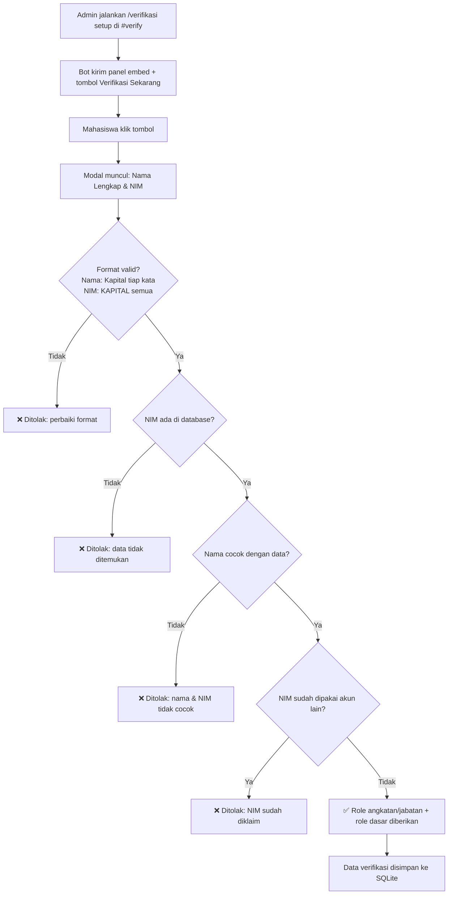

# Multifunctional Bot Specially for Jambi University Discord Community.

Bot Discord full-stack untuk server **Informatika Universitas Jambi**, dibangun dengan [discord.js v14](https://discord.js.org/) dan database **SQLite**. Bot ini menangani tiga kebutuhan inti server:

1. **Verifikasi Mahasiswa** — anggota memverifikasi identitas (Nama & NIM) lewat form modal Discord, dicocokkan ke basis data mahasiswa, lalu otomatis diberi role sesuai angkatan/jabatan.
2. **Pemilihan Komting** — admin (`ADMIN IF`) membuat voice channel privat secara instan untuk sesi pemilihan komting, lengkap dengan pengaturan hak akses.
3. **Auto Welcomer & Leaver** — embed selamat datang & perpisahan yang estetik ketika anggota bergabung/keluar, di satu channel yang sama.

Seluruh teks yang ditampilkan bot (aturan verifikasi, pesan welcome, dsb) dikumpulkan di satu file (`src/config/messages.js`) supaya mudah kamu ubah sendiri tanpa menyentuh logika program.

---

## 📁 Struktur Project

```
discord-bot-if-unja/
├── src/
│   ├── index.js                 # Entry point bot
│   ├── deploy-commands.js       # Script pendaftaran slash command
│   ├── config/
│   │   ├── config.js            # Loader environment variable (.env)
│   │   └── messages.js          # ✏️ SEMUA teks & warna embed — edit di sini
│   ├── database/
│   │   ├── db.js                # Koneksi & migrasi SQLite
│   │   └── repositories.js      # Query database (students, verified, role mapping, dst)
│   ├── utils/
│   │   ├── validators.js        # Validasi format Nama & NIM
│   │   ├── permissions.js       # Cek role ADMIN IF
│   │   ├── embeds.js            # Builder embed reusable
│   │   ├── csv.js                # Parser CSV import mahasiswa
│   │   └── logger.js
│   ├── handlers/
│   │   ├── commandHandler.js    # Loader semua command
│   │   └── verifyHandler.js     # Logika inti verifikasi (panel, modal, pencocokan DB)
│   ├── commands/
│   │   ├── verifikasi/          # /verifikasi setup, /verify
│   │   ├── mahasiswa/           # /mahasiswa tambah|hapus|cari|list|import
│   │   ├── role/                # /role-mapping set|hapus|list
│   │   ├── pengaturan/          # /pengaturan welcome-channel|verified-role|admin-role|lihat
│   │   ├── komting/             # /komting setup|tutup|list
│   │   └── umum/                # /ping
│   └── events/
│       ├── ready.js
│       ├── interactionCreate.js
│       ├── guildMemberAdd.js
│       └── guildMemberRemove.js
├── data/
│   ├── bot.sqlite               # (dibuat otomatis saat pertama kali dijalankan)
│   └── students.sample.csv      # Contoh format import data mahasiswa
├── Dockerfile / docker-compose.yml
├── .env.example
└── package.json
```

---

## 🧠 Alur Kerja Verifikasi



Bot **tidak** menebak role dari format NIM — setiap mahasiswa didaftarkan manual/impor CSV oleh admin ke database beserta kolom `angkatan` dan `jabatan` (opsional), sehingga akurat 100% sesuai data program studi, bukan asumsi pola NIM.

---

## 🚀 Instalasi & Menjalankan Bot

### 1. Prasyarat
- [Node.js](https://nodejs.org/) v18.17 atau lebih baru
- Akun Discord Developer — buat aplikasi bot di [Discord Developer Portal](https://discord.com/developers/applications)

### 2. Buat & Konfigurasi Aplikasi Bot
1. Buka **Discord Developer Portal** → **New Application**.
2. Masuk tab **Bot** → klik **Reset Token** untuk mendapatkan `DISCORD_TOKEN`.
3. Pada tab **Bot**, di bagian **Privileged Gateway Intents**, aktifkan:
   - ✅ **Server Members Intent** (wajib — dipakai untuk auto welcomer/leaver & pemberian role)
4. Catat **Application ID** di tab **General Information** sebagai `CLIENT_ID`.
5. Undang bot ke server dengan URL berikut (ganti `CLIENT_ID`):
   ```
   https://discord.com/api/oauth2/authorize?client_id=CLIENT_ID&permissions=268561552&scope=bot%20applications.commands
   ```
   Permission di atas mencakup: Manage Roles, Manage Channels, Manage Nicknames, Send Messages, Embed Links, Connect.

### 3. Clone / Salin Project & Install Dependency
```bash
cd discord-bot-if-unja
npm install
```

### 4. Konfigurasi Environment
```bash
cp .env.example .env
```
Isi `.env`:
```env
DISCORD_TOKEN=isi_token_bot_kamu
CLIENT_ID=isi_application_id
GUILD_ID=isi_id_server_discord_kamu   # aktifkan Developer Mode di Discord untuk copy ID
ADMIN_ROLE_ID=                        # opsional, isi ID role "ADMIN IF" (lihat catatan di bawah)
VERIFIED_ROLE_ID=                     # opsional, bisa diatur belakangan lewat command
DATABASE_PATH=./data/bot.sqlite
```

> ⚠️ **Catatan penting soal role admin:** Perintah `/mahasiswa`, `/role-mapping`, `/pengaturan`, dan `/komting` hanya bisa dijalankan anggota dengan role **`ADMIN IF`**. Kamu bisa mengisi `ADMIN_ROLE_ID` di `.env`, **atau** cukup pastikan ada role bernama persis `ADMIN IF` di server — bot akan otomatis mendeteksinya sebagai fallback. ID lebih diprioritaskan & lebih aman (nama role bisa berubah, ID tidak).

### 5. Deploy Slash Command
```bash
npm run deploy          # daftar instan ke 1 server (pakai GUILD_ID) — cocok untuk development
npm run deploy:global   # daftar global ke semua server bot terpasang (perlu ~1 jam untuk tampil)
```

### 6. Jalankan Bot
```bash
npm start
# atau untuk development (auto-restart saat file berubah):
npm run dev
```

### Alternatif: Menjalankan via Docker
```bash
docker compose up -d --build
```
Database SQLite otomatis tersimpan persisten di folder `./data` lewat volume mount.

---

## 🛠️ Panduan Penggunaan Command

### 1️⃣ Verifikasi Mahasiswa

| Command | Akses | Deskripsi |
|---|---|---|
| `/verifikasi setup [channel]` | ADMIN IF | Memasang panel embed + tombol verifikasi di channel `#verify` (atau channel yang dipilih) |
| `/verify` | Semua anggota | Alternatif cepat membuka form verifikasi tanpa lewat panel |

**Langkah setup pertama kali:**
1. Tambahkan dulu data mahasiswa ke database (lihat bagian *Kelola Data Mahasiswa* di bawah).
2. Hubungkan setiap angkatan (dan jabatan seperti "Kabinet") ke role Discord lewat `/role-mapping set`.
3. (Opsional) Atur role dasar yang otomatis diberikan ke semua orang yang lolos verifikasi: `/pengaturan verified-role`.
4. Jalankan `/verifikasi setup` di channel `#verify`.

Contoh pesan yang akan tampil di `#verify` (bisa kamu ubah kata-katanya di `src/config/messages.js` → `VERIFY_PANEL`):

> **📋 Verifikasi Keanggotaan — Informatika UNJA**
> Selamat datang! Untuk mendapatkan akses penuh serta role yang sesuai...
>
> **📌 Ketentuan Pengisian Data**
> 1. Isi **Nama Lengkap** sesuai data akademik. Setiap awal kata **wajib** Huruf Kapital.
> 2. Isi **NIM** menggunakan **HURUF KAPITAL** semua.
> 3. Nama & NIM harus sama persis dengan data program studi.
> 4. Satu NIM hanya untuk satu akun Discord.
>
> `[ ✅ Verifikasi Sekarang ]`

### 2️⃣ Kelola Data Mahasiswa

| Command | Deskripsi |
|---|---|
| `/mahasiswa tambah nim nama angkatan [jabatan]` | Tambah/update satu data mahasiswa |
| `/mahasiswa hapus nim` | Hapus satu data |
| `/mahasiswa cari nim` | Cek data berdasarkan NIM |
| `/mahasiswa list [angkatan]` | Lihat daftar data (bisa difilter per angkatan) |
| `/mahasiswa import file:<csv>` | **Impor massal** dari file `.csv` |

Format CSV untuk `/mahasiswa import` (lihat contoh di `data/students.sample.csv`):
```csv
nim,nama_lengkap,angkatan,jabatan
G1A024001,Ahmad Fadillah,2024,
G1A024002,Siti Nur Aisyah,2024,Kabinet
G1A023015,Bagus Setiawan,2023,
```
- Kolom `jabatan` boleh dikosongkan.
- Baris dengan NIM yang sudah ada akan **diperbarui** (bukan duplikat).

### 3️⃣ Role Mapping (Angkatan/Jabatan → Role Discord)

| Command | Deskripsi |
|---|---|
| `/role-mapping set jenis:Angkatan nilai:2024 role:@Angkatan24` | Semua mahasiswa angkatan 2024 otomatis dapat role `@Angkatan24` saat verifikasi |
| `/role-mapping set jenis:Jabatan nilai:Kabinet role:@Kabinet` | Mahasiswa dengan kolom `jabatan = Kabinet` dapat role tambahan `@Kabinet` |
| `/role-mapping list` | Lihat seluruh mapping aktif |
| `/role-mapping hapus jenis:... nilai:...` | Hapus satu mapping |

### 4️⃣ Pemilihan Komting

```
/komting setup jumlah:3 akses:@Angkatan24 label:"Pemilihan Komting 2024"
```
- **`jumlah`** — berapa voice channel yang dibuat (1–20).
- **`akses`** — role yang boleh melihat & join channel (misalnya role angkatan yang sedang memilih).
- **`label`** *(opsional)* — nama sesi, dipakai sebagai nama kategori.
- **`tambahan`** *(opsional)* — mention/ID anggota lain (misalnya panitia) yang juga diberi akses, contoh: `@Panitia1 @Panitia2`.
- **`terlihat`** *(opsional, default `false`)* — jika `true`, channel tetap kelihatan di daftar tapi hanya yang berhak yang bisa connect. Default-nya channel disembunyikan total dari yang tidak berhak.

Bot otomatis membuat 1 **kategori** + voice channel sejumlah `jumlah` di dalamnya, dengan permission privat.

Setelah selesai:
```
/komting list      → melihat sesi yang masih aktif beserta ID-nya
/komting tutup      → menghapus sesi terbaru (kategori + semua voice channel-nya)
/komting tutup sesi_id:3   → menghapus sesi tertentu berdasarkan ID
```

> 🔒 Semua subcommand `/komting` hanya bisa dijalankan oleh anggota dengan role **ADMIN IF**.

### 5️⃣ Pengaturan Umum

| Command | Deskripsi |
|---|---|
| `/pengaturan welcome-channel channel:#welcome` | Set channel untuk pesan join **dan** leave (satu channel yang sama) |
| `/pengaturan verified-role role:@Verified` | Role dasar yang diberikan ke semua yang lolos verifikasi |
| `/pengaturan admin-role role:@ADMIN-IF` | Override role admin bot (alternatif dari `.env`) |
| `/pengaturan lihat` | Menampilkan seluruh konfigurasi server saat ini |

### 6️⃣ Auto Welcomer & Leaver
Begitu `/pengaturan welcome-channel` diatur, bot otomatis mengirim embed berikut:

- **Saat member baru join** — judul *"Selamat datang di discord Informatika - Universitas Jambi"*, dengan foto profil member sebagai thumbnail dan jumlah member saat ini di footer.
- **Saat member keluar** — judul senada bertema perpisahan, dikirim ke **channel yang sama**.

Ingin mengubah kata-katanya? Tinggal edit `WELCOME` dan `LEAVE` di `src/config/messages.js` — tidak perlu menyentuh kode lain.

---

## 🗃️ Skema Database (SQLite)

| Tabel | Fungsi |
|---|---|
| `students` | Data master mahasiswa: `nim`, `nama_lengkap`, `angkatan`, `jabatan` |
| `verified_members` | Mengikat 1 akun Discord ↔ 1 NIM yang sudah lolos verifikasi |
| `role_mappings` | Mapping `angkatan`/`jabatan` → `role_id` Discord, per-server |
| `guild_settings` | Konfigurasi per-server: channel welcome, channel verify, role admin, role verified |
| `komting_sessions` | Riwayat & status sesi voice channel pemilihan komting |

Database tersimpan sebagai file lokal (`data/bot.sqlite`) menggunakan [`better-sqlite3`](https://github.com/WiseLibs/better-sqlite3) — tidak perlu server database terpisah, cukup file, ringan, dan cepat. Backup cukup dengan menyalin file `.sqlite` tersebut.

---

## 🎨 Kustomisasi

Semua yang biasanya ingin diubah ada di **satu file**: `src/config/messages.js`
- Teks aturan panel verifikasi (`VERIFY_PANEL`)
- Judul & isi pesan sukses/gagal verifikasi (`VERIFY_RESULT`)
- Judul & field welcome/leave (`WELCOME`, `LEAVE`)
- Warna embed (`COLORS`) — pakai format hex `0xRRGGBB`
- Teks embed komting (`KOMTING`)

Format validasi Nama & NIM ada di `src/utils/validators.js` jika suatu saat aturan formatnya ingin diubah (misalnya mengizinkan NIM dengan spasi, dsb).

---

## 🩹 Troubleshooting

| Masalah | Kemungkinan Penyebab & Solusi |
|---|---|
| Bot tidak merespons slash command | Jalankan `npm run deploy` ulang, pastikan bot online, cek `GUILD_ID` benar |
| Role tidak otomatis diberikan saat verifikasi | Pastikan role hasil `/role-mapping` **posisinya di bawah** role bot di pengaturan **Server Settings → Roles** (Discord tidak mengizinkan bot memberi role yang lebih tinggi dari posisinya) |
| Welcome/leave message tidak muncul | Jalankan `/pengaturan welcome-channel` dan pastikan **Server Members Intent** aktif di Developer Portal |
| `/komting setup` gagal membuat channel | Pastikan bot memiliki izin **Manage Channels** di server |
| Command admin ditolak padahal sudah jadi admin | Pastikan role bernama **persis** `ADMIN IF`, atau set manual lewat `/pengaturan admin-role` / `ADMIN_ROLE_ID` di `.env` |
| Error `better-sqlite3` gagal di-install | Pastikan ada build tools (`python3`, `make`, `g++`) terpasang di OS kamu, atau gunakan Docker yang sudah disediakan |

---

## 📦 Tech Stack

- [discord.js v14](https://discord.js.org/) — library interaksi Discord API
- [better-sqlite3](https://github.com/WiseLibs/better-sqlite3) — database embedded, sinkron & cepat
- [csv-parse](https://csv.js.org/parse/) — parsing file impor data mahasiswa
- Node.js ≥ 18.17

Seluruh dependensi di atas bersifat **open source** (lisensi MIT).

---

## 📄 Lisensi
Proyek ini dirilis di bawah lisensi **MIT** — bebas digunakan, dimodifikasi, dan dikembangkan lebih lanjut oleh Himpunan Mahasiswa Informatika Universitas Jambi atau siapa pun yang membutuhkan. Lihat [`LICENSE`](./LICENSE).
